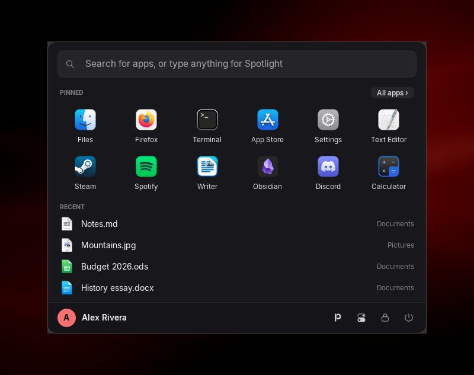
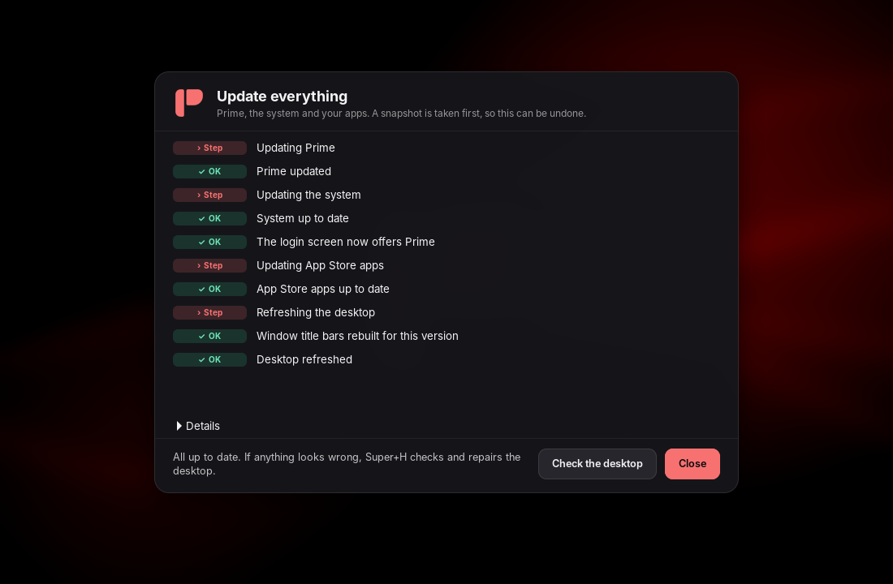

# Prime Linux

**A desktop that sets itself up, explains itself, and undoes a bad update.**
Prime Linux is a layer on top of CachyOS: one line to install, one click to remove.

> **Beta.** v2026.10 is the first release. It's tested on real hardware, but
> expect rough edges. Please [report what breaks](https://github.com/sean-morrissey/prime-linux/issues).



## Install

On a computer running [CachyOS](https://cachyos.org), open a terminal, paste this
line (**Ctrl+Shift+V**), and press Enter:

```bash
curl -fsSL https://raw.githubusercontent.com/sean-morrissey/prime-linux/stable/boot.sh | bash
```

It asks for your password once and takes 5–15 minutes. Then log out, choose
**Prime** on the login screen, and log in. Your existing desktop stays on the
login screen as the other choice.

New to Linux? The **[user guide](docs/USER-GUIDE.md)** starts from installing CachyOS.

## What you get

**Everything in one place.** The **P** in the corner opens Start. **Super+Space**
finds apps, files, settings and sums. **Super+I** opens Settings, written in plain
words. **Super+/** lists every shortcut.

**Updates you can undo.** Updates install overnight, after a snapshot. If one goes
wrong, Settings → Updates → **Undo the last update**, or pick the older entry in the
boot menu. [How it works](docs/UPDATES-AND-SAFETY.md).



**A computer that checks itself.** **Super+H** runs a health check that explains
what it found in sentences and repairs what it safely can.

**Packs for what you do.** Gaming, coding, creating and studying each set up their
apps, shortcuts and settings in one step. [Packs](docs/PACKS.md).

**An assistant, if you want one.** Off until you connect a model (on this computer,
on your network, or a service you choose). You decide how much it may do, every
change it makes is logged, and every change can be undone. [The assistant](docs/ASSISTANT.md).

## Remove it

Settings → Troubleshooting → **Remove Prime** puts the computer back the way it
was. From a terminal: `prime-uninstall`.

## More

- [User guide](docs/USER-GUIDE.md): install to everyday use
- [Bringing an existing Hyprland setup along](docs/MIGRATING.md)
- [How the layer is built](docs/PRIME-LAYER.md) · [Releases and signing](docs/RELEASE.md) · [Changelog](CHANGELOG.md)
- Try it without changing anything: add `-s -- --dry-run` to the end of the install line.
- Tests: `tests/check-*.sh`, `tests/install-in-container.sh` (clean Arch container, install and uninstall), `tests/vm/run.sh all` (real CachyOS VM).

## License

Code: [GPL-3.0-or-later](LICENSE). Brand marks and wallpapers: CC0
([branding](layer/branding/LICENSE), [wallpapers](layer/wallpapers/LICENSE)).
